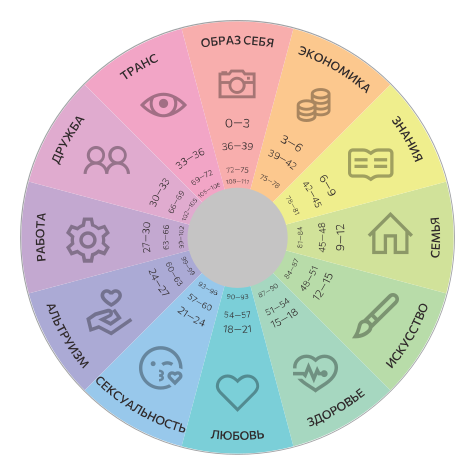

# Психоалхимия

Cистема сознательного изменения личности. 

Автор — Марина Комиссарова.

::: card
## Круг ресурсов

Деление всей сферы жизни человека на 12 сегментов условно, однако, будучи издревле вписанной в культуру, такая схема отражает много закономерностей, поэтому для современной психологии представляет большой интерес, о чем говорили и говорят многие психологи.

Главное достоинство круга ресурсов в том, что расположение ресурсов именно в таком порядке помогает видеть биологические и социальные закономерности. Противоположные ресурсы образуют одну линию и дополняют друг друга, я об этом часто пишу. Подключать ресурсы легче всего через соседние, вы тоже в курсе (логично ведь, тот, что сформировался до и тот, что сформировался позже, могут совместно включить пропущенный). В круге, благодаря удачному строению, есть еще огромное количество соответствий и закономерностей (не магического толка, а биологического и социального).
:::

::: card
## Последовательность развития ресурсов

Ресурсы расположены в виде замкнутого круга — цикл из 12 периодов, каждый условно 3 года.

Последовательность формирования ресурсов описывает формирование человеческой личности.

<ResourcesEvolve />
:::

::: card
## Баланс направления внутрь и наружу

<ResourcesInOut />
:::

::: card
## Источники

- [Психоалхимия — psychoalchemy.ru](http://psychoalchemy.ru)
- [Блог Эволюция — evo-lutio.livejournal.com](https://evo-lutio.livejournal.com/)

Система опирается на синтез классических представлений о пластичности человеческой личности:
- теории психического поля Владимира Бехтерева;
- теории энергетической системы Пьера Жане;
- теории энергетического потока Уильяма Джеймса;
- динамической теории поля Курта Левина;
- динамической теории сознания Льва Выготского;
- теории сознания как деятельности Алексея Леонтьева;
- теории построения личности Гордона Олпорта и другие.
:::

