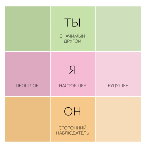

Для лучшего понимания этих карточек, обращайтесь к [конспекту](../../synopsis/nlp/index.md)

::: card

## Нейрологические уровни

Модель научения Г. Бейтсона легла в основу теории нейро-логических уровней Р. Дилтса.

<nlp-levels />

:::

::: card

## Карта ресурсов: 6 уровней, три позиции, три времени

:::

::: card

## Карта внимания внутри уровней

:::
