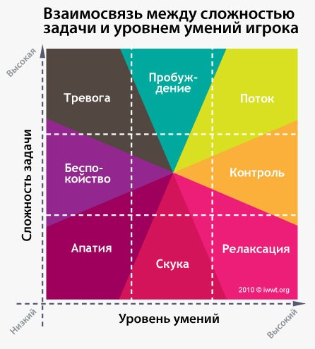
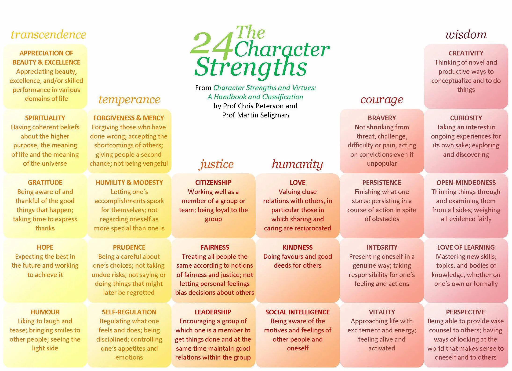

Направление современной психологии, которое занимается исследованием условий благополучия и позитивного развития человека. В основные темы исследований позитивной психологии входят, в частности, условия счастья людей, оптимизм, поток, смысл, духовность.

#### Подробнее — [в конспекте](../../synopsis/positive/index.md)

::: card

:::

::: card

## Черты состояния потока

<positive-flow />
:::

::: card

## Мудрость

По книге М. Чиксентмихайи «Эволюция личности»

### Три завесы майи

- мир генов,
- мир культуры,
- мир личности.

### Три грани мудрости

#### 1. Разум — способ познания или когнитивная способность

За изменчивыми внешними сторонами бытия мудрость старается разглядеть его основу — вечные общие истины

#### 2. Добродетель — одобряемый обществом способ действия

Мудрый человек действует гармонично, поскольку его направляет более широкое понимание общего блага. В этом смысле мудрость пропорциональна величине группы, о благополучии которой заботится мудрый человек.

Мудрость — это:

- учет не только ближайших результатов, но и будущих, отдаленных,
- забота не только о своем благополучии, но и окружающих,
- направление усилий не только на одну цель, но на взаимосвязанность целей.

#### 3. Верховное счастье — личное благо, которое прождается из внутреннего мира и радости, рождаемых мудростью

Мудрый наслаждается тем, что он — часть могущественных сил, пронизывающих вселенную и проявляющихся в своем временном аспекте в данном в недолгое пользование теле.

> Культуры редко достигают гармонии. Чаще общество впадает в крайности: либо превращая виживание в слишком сложную задачу, либо устанавливая чрезмерно жесткий порядок, лишающий возможности действовать самостоятельно.

:::

::: card

## 5 элементов благополучия

Элементы ПЕРМА определяются по трем качествам:

- Это способствует хорошему самочувствию.
- Его преследуют ради него самого
- Он определяется и измеряется независимо от других элементов

### Положительные эмоции

включают в себя широкий спектр чувств, а не только счастье и радость. Сюда входят такие эмоции, как возбуждение, удовлетворение, гордость и трепет. Эти эмоции часто рассматриваются как связанные с положительными результатами, такими как более долгая жизнь и более здоровые социальные отношения.

### Вовлеченность

Участие в деятельности, которая основывается на чьих-то интересах. Поток, состояние глубокого вовлечения без усилий, чувство интенсивности, которое приводит к чувству экстаза и ясности. Выполняемая задача должна требовать более высоких навыков и быть немного сложной, но все же возможной. Вовлеченность предполагает увлеченность и концентрацию на текущей задаче, и субъективно оценивается, был ли занятый человек полностью поглощен, теряя самосознание.

### Отношения

Необходимы для подпитки положительных эмоций, будь то рабочие, семейные, романтические или платонические. Как просто выразился Кристофер Петерсон, «другие люди имеют значение». Люди получают, делятся и распространяют позитив через отношения. Они важны не только в плохие, но и в хорошие времена. На самом деле отношения можно укрепить, положительно реагируя друг на друга. Типично, что большинство положительных вещей происходит в присутствии других людей.

### Значение

Также известно как цель и вызывает вопрос «почему». Обнаружение и выяснение четкого «почему» помещает все в контекст, от работы до отношений и других сфер жизни. Обретение смысла - это познание того, что есть что-то большее, чем вы сами. Несмотря на потенциальные проблемы, работа со смыслом побуждает людей продолжать стремиться к желаемой цели.

### Достижения

Это стремление к успеху и мастерству. В отличие от других частей PERMA, к ним иногда стремятся, даже если достижения не приводят к положительным эмоциям, значению или отношениям. Достижения могут быть индивидуальными или общественными, развлекательными или рабочими.

:::

::: card

## 6 общечеловеческих добродетелей

<positive-values />
:::

::: card

## 24 достоинства

Селигман и Петерсон считают, что составили универсальный список достоинств. Это означает, что каждая культура ценит эти достоинства. Более того, они думают, что это исчерпывающий список: любое другое возможное достоинство можно отнести к этим основным достоинствам. Это большое и очень амбициозное требование!

Добродетели делятся на категории, которые объединяют добродетели некоторой степени связанные друг с другом. Однако наиболее важными являются сами добродетели: они на самом деле используются для исследования сил персонажа.

<positive-virtues />

:::

::: card

:::
