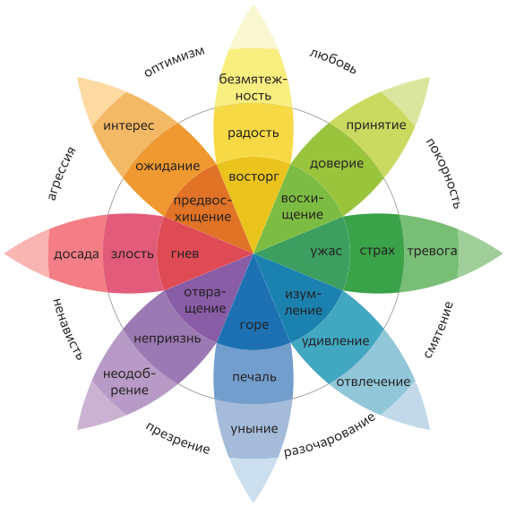

---
basic:
  - 
    title: Инкорпорация
    icon: 🤩
    event: Приятный объект, член группы
    feeling: Восхищение
    doing: Содействие
    q: Друг
    text: Поедание пищи или принятие благоприятных раздражителей внутрь организма. Этот психологический механизм ещё известен как интроекция.
  - 
    title: Отвержение
    icon: 🤢
    event: Отвратительный объект
    feeling: Отвращение
    doing: Отталкивание
    q: Отрава
    text: Избавление организма от чего-либо непригодного, что было воспринято ранее.
  - 
    title: Протекция
    icon: 😱
    event: Угроза
    feeling: Ужас
    doing: Бегство
    q: Опасность
    text: Поведение, призванное обеспечить избегание опасности или вреда. Сюда относится бегство и любое другое действие, которое увеличивает расстояние между организмом и источником опасности.
  - 
    title: Разрушение
    icon: 😡
    event: Препятствие 
    feeling: Гнев
    doing: Нападение
    q: Враг
    text: Поведение, призванное разрушить барьер, который препятствует удовлетворению важной потребности.
  - 
    title: Воспроизводство
    icon: 😍
    event: Потенциальный партнер
    feeling: Восторг
    doing: Ухаживание
    q: Обладать
    text: Репродуктивное поведение, которое может быть определено в терминах приближения, тенденции к сохранению контакта и смешивания генетических материалов.
  - 
    title: Реинтеграция
    icon: 😢
    event: Потеря значимого индивида
    feeling: Горе
    doing: Призыв к воссоединению
    q: Потерянность
    text: Поведенческая реакция на потерю чего-либо важного, чем обладали или наслаждались. Его функция в обретении вновь опеки.
  - 
    title: Ориентация
    icon: 😳
    event:  Новый объект
    feeling: Изумление
    doing: Остановка
    q: Что это?
    text: Поведенческая реакция на контакт с неизвестным, новым или неопределенным объектом.
  - 
    title: Исследование
    icon: 🧐
    event: Новая территория
    feeling: Предвосхищение
    doing: Обследование
    q: Что там?
    text: Поведение, обеспечивающее индивиду схематичное представление о данной окружающей среде.
---

# Адаптационная теория эмоций 

Теория разрабатывалась Робертом Плутчиком в виде монографии в 1962 году. Она получила международное признание и использовалась для раскрытия структуры групповых процессов, позволила сформировать представление о внутриличностных процессах и механизмах психологических защит. В настоящее время основные постулаты теории включены в известные психотерапевтические направления и психодиагностические системы.

:::card
## Эмоции — это механизмы коммуникации и выживания, основанные на эволюционной адаптации. 

Они сохраняются в функционально эквивалентных формах через все филогенетические уровни

<adaptive-main v-for="(emotion, id) in $frontmatter.basic" :key="emotion.title" :emotion="emotion" :id="id" />

:::

::: card

##  Пары противоположных базовых эмоций

### Гнев — страх
### Предвосхищение — изумление
### Восторг — горе
### Отвращение — восхищение

:::

::: card

## Колесо эмоций

:::

::: card

## Трехмерная модель эмоций — конус Плутчика

Сила эмоции возрастает снизу вверх.

:::