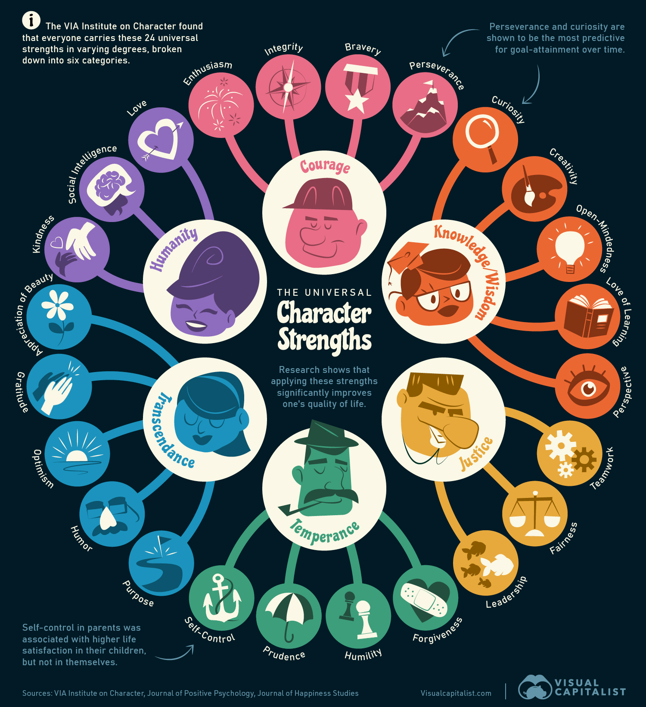

## Books

- [Values in action scale and the Big 5. An empirical indication of structure](/books/MacdonaldBoreMunro2009.pdf)
- [Character Strengths Interventions. A Field Guide for Practitioners. Ryan M. Niemiec](/books/ryan-niemiec-character-strengths-interventions-a-field-guide-for-practitioners-2017.pdf)
- [Character Strengths and Virtues. A Handbook and Classification. CHRISTOPHER PETERSON, MARTIN E. P. SELIGMAN](/books/character-strengths-and-virtues.pdf)
https://posproject.org/character-strengths/

## What is Character?

Character is more than simply individual achievement. It’s the intersection of our thoughts, our feelings, and our behaviors. Character is the aggregate of who we are; it’s “what’s inside every one of us.”

Character is not fixed; it can be grown. This is very similar to Dr. Carol Dweck’s growth mindset. Dweck’s theory explains that some people think their abilities are fixed and that any failure is a confirmation of their limits. While other people believe that they can grow their abilities and that failure is just a stepping stone to improvement.

Well, character works the same way. And, there is no endpoint to developing your character. It’s a lifelong endeavor for every single one of us.

And, as Dr. Peterson wrote, focusing on character strengths “would not only make young people happier, healthier, and more socially connected but also help them do better at school and to be more productive at their eventual work. Attention to young people’s character is not a luxury for our society but a necessity, and it requires no tradeoff with traditional academic goals.”
Difference Between Character Strengths and Values

Are character strengths the same as values? Not necessarily. Character strengths are positive personality traits that reflect our basic identity — and produce positive outcomes for ourselves and others. However, as Dr. Peterson explains in A Primer in Positive Psychology, “Values are beliefs held by individuals and shared by groups about desirable ends…they guide how we select actions and evaluate others and ourselves; and they are ordered by their relative importance.” Therefore, individuals use their character strengths to move toward their specific values.

For example, the core values of the United States Military Academy at West Point are Duty, Honor, Country. Cadets will use their individual character strengths — such as perseverance, teamwork, and self-control — to move towards those values. As General MacArthur explained to cadets in 1962, “Duty, honor, country: Those three hallowed words reverently dictate what you ought to be, what you can be, what you will be. They are your rallying point to build courage when courage seems to fail, to regain faith when there seems to be little cause for faith, to create hope when hope becomes forlorn.”

## What Is Positive Psychology?

Positive psychology is a rigorous academic field that encompasses character strengths, positive relationships, positive experiences, and positive institutions. It is the scientific study of what makes life most worth living — and maintains that what is good in life is as genuine as what is bad.

Although positive psychology focuses on what goes right in life, it doesn’t ignore what goes wrong. As Drs. Peterson and Seligman wrote in Character Strengths and Virtues, “There is a temptation to regard positive psychology as focusing on the stress-free individual, but this is a mistake… In accentuating the positive, we cannot ignore the negative. Conditions of adversity, whether external or internal, must be part of what we address in discussing character strengths.”

-------------;

## A Closer Look at the 24 Strengths

The VIA’s research grouped 24 universal strengths into six main categories referred to as virtues.

Seligman found that these virtues were seen across cultures and history, and the spectrum of character strengths are a form of living out various virtues.

Interestingly, what they found was that each of these strengths of character can emerge through effort—instead of being fixed qualities found in a person.

This graphic shows the 24 universal strengths from the VIA Institute on Character.

## Category Strengths

### 🦁 Courage

These emotional strengths empower us to tackle adversity and how we tend to work through it.

- Enthusiasm
- Integrity
- Bravery

### 🧠 Knowledge/Wisdom

These strengths are useful in helping us learn and gather knowledge.

- Curiosity
- Creativity
- Open-Mindedness
- Love of Learning
- Perspective

### ⚖️ Justice

With these strengths, we relate to those around us in social or group situations.

- Teamwork
- Fairness
- Leadership

### 🙇‍♂️ Temperance

Temperance strengths help us manage habits and protect against excess, including managing and overcoming vices.

- Forgiveness
- Humility
- Prudence
- Self-Control

### 🌌 Transcendence

As a virtue, transcendence strengths connect us to the world around us in a meaningful way.

- Purpose
- Humor
- Optimism
- Gratitude
- Appreciation of Beauty

### 🌍 Humanity

These strengths come into play by helping us build and maintain positive, warm relationships with others.

- Kindness
- Social Intelligence
- Love

The above strengths were also shown to be broadly stable in individuals over time. However, the most malleable strengths were humor, prudence, and spirituality.

Increasing hope, zest, love, and curiosity was found to have the strongest impact on boosting life-satisfaction, based on a study of almost 16,000 people.

Separately, studies showed that curiosity and perseverance are shown to be the most predictive for goal-attainment over time, while self-regulation in parents is associated with higher life satisfaction in their children—but not among themselves.

But some studies have noted flaws with the six-virtue model proposed for organizing character strengths, including some fitting into multiple virtues. Instead, there have been propositions for grouping strengths by five factors, four, and even just one factor such as a global character trait.

## How Character Strengths Impact Decision-Making

People’s different strengths may also play a role in different types of decision-making.

When examining types of cognitive styles, we can see that some people use analytical reasoning versus decisions based on intuition. Those using an analytical approach have been shown to use things like cost-benefit analysis and rational reasoning. One study shows that people who relied on this style had a stronger correlation to self-control.

By contrast, those who rely on intuition are comparatively more prosocial and were shown to have a higher correlation with caring traits.

Interestingly, leadership traits were shown to be more complex, correlating to both analytical and intuitive decision-making styles.

-------------

## Values in Action Inventory of Strengths

The VIA Inventory of Strengths (VIA-IS), formerly known as the "Values in Action Inventory," is a proprietary psychological assessment measure designed to identify an individual's profile of "character strengths".

It was created by Christopher Peterson and Martin Seligman, researchers in the field of positive psychology, in order to operationalize their Character Strengths and Virtues Handbook (CSV). The CSV is the positive psychology counterpart to the Diagnostic and Statistical Manual of Mental Disorders (DSM) used in traditional psychology.

Unlike the DSM, which scientifically categorizes human deficits and disorders, the CSV classifies positive human strengths. The CSV helps people recognize and build upon their strengths. This aligns with the overall goal of the positive psychology movement, to make people's lives more fulfilling. People can use the VIA-IS to identify their own positive strengths and learn how to capitalize on them.

### Classification of strengths

- **Wisdom:** creativity, curiosity, judgment, love of learning, perspective
- **Courage:** bravery, perseverance, honesty, zest
- **Humanity:** love, kindness, social intelligence
- **Justice:** teamwork, fairness, leadership
- **Temperance:** forgiveness, humility, prudence, self-regulation
- **Transcendence:** appreciation of beauty and excellence, gratitude, hope, humor, spirituality.

## Composition and administration

The VIA-IS is a 96-question measure of 24 character strengths. On average, an individual will complete the VIA-IS in 10 to 15 minutes. As of 2023, the survey is available online and one can retrieve one's results for US$49, at www.viacharacter.org, and over 27,000,000 people have participated.

Participants are instructed to answer each item on the VIA-IS in terms of “whether the statement describes what you are like”. Participants respond according to a five-point Likert scale ranging from (1=very much unlike me, 5=very much like me). Sample items include “I find the world a very interesting place”, which gauges curiosity, and “I always let bygone be bygones”, which gauges forgiveness.

People can score anywhere from 10 to 50 points for each of the 24 strengths. A higher score on a scale indicates that the participant more strongly identifies with that scale's associated strength. Score reports are delivered to each paying participant at the completion of the survey. Feedback is provided for the signature strengths, but not for the lesser strengths. The results rank order the participant's strengths from 1–24, with the top four to seven strengths considered “signature strengths”.

.jpg)

## History

As a relatively new field of research, positive psychology lacked a common vocabulary for discussing measurable positive traits before 2004. Traditional psychology benefited from the creation of DSM, as it provided researchers and clinicians with the same set of language from which they could talk about the negative. As a first step in remedying this disparity between tradition and positive psychology, Peterson and Seligman set out to identify, organize, and measure character.

They began by defining the notion of character as traits that are possessed by an individual and are stable over time, but can still be impacted by setting and thus are subject to change. They brainstormed with a group of noted positive psychology scholars. They examined ancient cultures (including their religions, politics, education, and philosophies) for information about how people in the past construed human virtue. The researchers looked for virtues that were present across cultures and time. Six core virtues emerged from their analysis: courage, justice, humanity, temperance, transcendence, and wisdom.

Next, Peterson and Seligman proposed a model of classification. The hierarchical system is modeled after the Linnaean classification of species, which ranges from a specific species to more general and broad categories. The six core values are the broadest category and are, “core characteristics valued by moral philosophers and religious thinkers”.  Peterson and Seligman then moved down the hierarchy to identify character strengths, which are “the psychological processes or mechanisms that define the virtues”.

The researchers began identifying individual character strengths by brainstorming with a group of noted positive psychology scholars. Peterson and Seligman then performed an exhaustive literature search for work that directly addresses good character in the domains of, “psychiatry, youth development, philosophy, and psychology”. Some individuals who influenced Peterson's and Seligman's choice of strengths include: Abraham Maslow, Erik Erikson, Ellen Greenberger, Marie Jahoda, Carol Ryff, Michael Cawley, Howard Gardner, and Shalom Schwartz. The researchers also looked for virtue-laden messages in popular culture. For example, the researchers examined Hallmark greeting cards, personal ads, graffiti, bumper stickers, and profiles of Pokémon characters.

After identifying dozens of "candidate strengths", the researchers refined their list by subjecting them to a list of ten criteria (e.g., strengths must contribute to a sense of a fulfilling life, must be intrinsically valuable) to help them select the final 24 strengths for the CSV. Approximately half of the strengths included in the CSV meet all ten criteria, and half do not. By looking for similarities between candidate strengths, the researchers distributed 24 character strengths between six virtue categories. After creating this a priori organization of traits, the researchers performed, “an exploratory factor analysis of scale scores using varimax rotation,” from which five factors emerged. Peterson & Seligman state that they are not as concerned with how the 24 strengths are grouped into virtue clusters because, in the end, these traits are mixed together to form the character of a person.
Validity and reliability

Peterson and Seligman state that all character strengths must be[why?] measurable. Of the 24 strengths, most can be assessed using self-report questionnaires, behavioral observation, peer-report methods, and clinical interviews. Three strengths, however, have yet to be reliably assessed: humility, modesty, and bravery. The researchers acknowledge that some strengths are more difficult to assess than others, therefore methods of assessing these strengths are still in-progress.

For each strength, there are typically several measures that could be administered in order to assess a person's trait level for that strength. Time and energy, however, prohibit administering all of the measures for the 24 strengths in one testing session. To solve this problem, Peterson & Seligman designed a new measure, the VIA-IS, to assess all 24 strengths in relatively brief amount of time. Beginning in the fall of 2000, the researchers pilot tested the VIA-IS with a group of 250 adults. The researchers removed items that correlated poorly with the rest of the items in the same scale of interest. Peterson & Seligman repeated this process until Cronbach's alpha for all scales exceeded .70. The researchers added three reverse-scored items in each of the 24 scales as well. For the current[may be outdated as of October 2023] version of the VIA-IS, test-retest correlations for all scales during a four-month period are > .70.

Peterson & Seligman provide limited data on the validity and reliability of the VIA-IS; the only published statistics are those stated above. The researchers say that they will provide the full statistical results of their analysis of the VIA-IS in a future publication. However, other researchers have published studies that challenge the validity of this six-factor structure.
Empirical findings and limitations

Although researchers have not yet examined the validity and reliability of the VIA-IS, they are beginning to look at how the 24 character strengths are distributed within the United States and international populations. Researchers found that, within the United States, the most commonly endorsed strengths are kindness, fairness, honesty, gratitude, and judgment. The lesser strengths demonstrated consistency across states and regions as well: prudence, modesty, and self-regulation. The researchers did not find regional differences in the rank-order of strengths, with the exception of the South demonstrating slightly higher scores for religiousness.

When the rank order of prevalence of character strengths in the U.S. is compared to that of 53 other countries, scientists found the relative pattern of rank ordering did not differ. This finding provides evidence to support Peterson & Seligman's assertion that their classification system is composed of universally acknowledged strengths.

The results of this study have limitations. Respondents to the survey must speak English, as the VIA-IS was not translated into each respondent's native language. This may restrict the extension of these results to non-English speakers.

In an earlier study, researchers administered the English-language version of the VIA-IS to individuals in 40 countries. Worldwide, the following strengths were most associated with positive life satisfaction: hope, zest, gratitude, and love. The researchers called these "strengths of the heart". Strengths associated with knowledge, such as love of learning and curiosity, were least correlated with life satisfaction.
United Kingdom

Scientists have also performed more in-depth analyses of the VIA-IS when it is applied to populations outside of the United States. Linley and colleagues did not simply compare the rank-order of strengths of the U.S. to other countries. They administered the VIA-IS to 17,056 individuals living in the United Kingdom between 2002 and 2005. Compared to the entire U.K. population, the study's sample was better educated, and was composed of more women and fewer elderly individuals.

The researchers found that as people aged, strength scores tended to increase. Using Pearson's correlations, researchers looked for associations between age and strengths. The following strengths showed the strongest correlations: love of learning, curiosity, forgiveness, self-regulation, and fairness. Humor did not follow this pattern, and was negatively correlated with age.

In terms of statistically significant gender differences, women demonstrated higher scores for interpersonal strengths (kindness, love, and social intelligence) and appreciation of beauty and gratitude. Men scored significantly higher than women on creativity. For men and women, four of the top five signature strengths were the same: open-mindedness, fairness, curiosity, and love of learning.

When the means and standard deviations were broken down by gender and age, they were consistent with those reported by U.S. samples. The rank ordering of the prevalence of strengths was comparable to the patterns found in the U.S. and other international samples. Once again, research supports Peterson & Seligman's assertion that the strengths listed in the CSV and VIA-IS are present in the majority of cultures.

An important limitation of this study, as with all studies that collect data via the internet, is that the samples tend to be more educated and from higher socioeconomic background because these individuals are more likely to have access and knowledge of the internet.
Japan

Shimai and colleagues tested the applicability of a translated version of the VIA-IS to a sample in Japan. The researchers administered the VIA-IS to 308 young adults from Japan and 1,099 young adults from the U.S. The scientists translated the VIA-IS into Japanese and then back to English in order to be examined by the original creators of the VIA-IS. They confirmed that the Japanese version of the VIA-IS demonstrated face validity, test-retest reliability and internal consistency before administering it to young adults.

The researchers found that top-ranked strengths, in terms of prevalence, for young adults in Japan, were similar to those of young adults in the U.S. The percentage of people who scored high or low on each character strength were similar between the two countries. The scientists did not find a significant variation in the pattern of gender differences between the United States and Japan. Women in both countries were more likely than men to score highly on the strengths of kindness, love, gratitude, teamwork, and appreciation of beauty, whereas men in both countries were more likely score highly on the strengths of open-mindedness, perspective, creativity, self-regulation, and bravery. The correlations between specific strengths and happiness outcomes were consistent as well. The strengths of zest, curiosity, gratitude, and hope were significantly positively correlated with subjective measures of happiness for both populations.

Differences between the young adults in Japan and the U.S. emerged as well. The rank-order of religiousness was the biggest difference between the cultures. For American young adults, religiousness was on average the 14th most prevalent strength. For Japanese young adults, religiousness was, on average, the 19th most prevalent strength. The researchers attributed this finding to the fact that some of the items on the VIA-IS that assess religiousness were based on Western connotations of religiosity (e.g. monotheistic traditions).

A notable limitation of this study is that the researchers examined young adults, rather than the population at-large. According to the researchers, young adults in Japan are more active participants in a more global, Americanized culture than the older generations. This could explain the commonalities found between young adults in Japan and the U.S.

Shimai and colleagues demonstrated that the VIA-IS can be successfully and accurately translated into other languages. When this is done, however, researchers need to ensure that the items on the scale are not culturally biased toward Western concepts.

### Character Strengths and Virtues

> Character Strengths and Virtues: A Handbook and Classification
> Author Christopher Peterson and Martin Seligman
> Language English;
> Genre Psychology, philosophy
> Publisher American Psychological Association and Oxford University Press
> Publication date
> 2004
> Pages 800
> ISBN 0-19-516701-5
> OCLC 803516802

Character Strengths and Virtues (CSV) is a book by Peterson and Seligman that attempts to present a measure of humanist ideals of virtue in an empirical, rigorously scientific manner, intended to provide a theoretical framework for practical applications for positive psychology. CSV identifies six classes of virtue (i.e. "core virtues") comprising 24 measurable "character strengths". The organization of the six virtues and 24 strengths is as follows:

- Wisdom and Knowledge: creativity, curiosity, open-mindedness, love of learning, perspective
- Courage: bravery, persistence, integrity, zest
- Humanity: love, kindness, social intelligence
- Justice: teamwork, fairness, leadership
- Temperance: forgiveness and mercy, humility, prudence, self control
- Transcendence: appreciation of beauty and excellence, gratitude, hope, humor, spirituality

CSV defines character strengths as satisfying most of the ten following criteria:

- contributes to individual fulfillment "for oneself and others"
- intrinsically valuable, in an ethical sense (gifts, skills, aptitudes, and expertise can be squandered, but character strengths and virtues cannot)
- non-rivalrous
- not the opposite of a desirable trait (a counterexample is steadfast and flexible, which are opposites but are both commonly seen as desirable)
- trait-like (habitual patterns that are relatively stable over time)
- not a combination of the other character strengths in the CSV
- personified (at least in the popular imagination) by people made famous through story, song, etc.
- observable in child prodigies (though this criterion is not applicable to all character strengths)
- absent in some individuals
- and nurtured by societal norms and institutions

CSV suggests that these six virtues are considered good by the vast majority of cultures and throughout history and that practicing these traits leads to increased happiness. Notwithstanding numerous caveats, this suggestion of universality hints that in addition to trying to broaden the scope of psychological research to include mental wellness, the leaders of the positive psychology movement are challenging moral relativism and suggesting that virtue has a biological basis. These arguments are in line with the science of morality.

Each of the 24 character traits is defined behaviorally, with psychometric evidence demonstrating that it can be reliably measured. The book shows that "empirically minded humanists can measure character strengths and virtues in a rigorous scientific manner."

Practical applications of positive psychology include helping individuals and organizations correctly identify their strengths and use them to increase and sustain their respective levels of well-being. Each trait "provides one of many alternative paths to virtue and well-being."
Therapists, counselors, coaches, and various other psychological professionals can use the new methods and techniques to build and broaden the lives of individuals who are not necessarily suffering from mental illness or disorder.

Other researchers have advocated grouping the 28 identified character traits into just four classes of strength (Intellectual, Social, Temperance, Transcendent) or even just three classes (without Transcendence). Not only is this easier to remember, but additionally there is evidence that these adequately capture the components of the 28 original traits.

## Applications

One of the major goals of positive psychology is to help people “cultivate and sustain the good life”.  The VIA-IS provides a practical measure that can be used to evaluate the efficacy of positive interventions. As one example, consider the thousands of people who participate in life coaching and character education programs every year.Strengths of character are often the outcome of interest, yet these programs do not employ a rigorous outcome measure in order to gauge efficacy. Researchers propose that if these programs used the VIA-IS, then they may discover unanticipated benefits of their interventions and that this would facilitate objective evaluation of its outcome.

Peterson & Seligman suggest that the VIA-IS could be used as a way to help people identify their signature strengths. With this knowledge, people could then begin to capitalize and build upon their signature strengths. Positive psychologists argue that the VIA-IS should not be used as a way to identify your ‘lesser strengths’ or weaknesses. Their approach departs from the medical model of traditional psychology, which focuses on fixing deficits. In contrast, positive psychologists emphasize that people should focus and build upon what they are doing well.
Criticism

Many studies have checked the factor structure of the CSV, on which the VIA-IS is based.

Using a second order factor analysis, Macdonald & colleagues found that the 24 strengths did not fit into the six higher order virtues model proposed in the CSV. None of the clusters of characters strengths that they found resembled the structure of the six virtue clusters of strengths. The researchers noted that many of the VIA character strengths cross-loaded onto multiple factors. Rather, the strengths were best represented by a one and four factor model. A one factor model would mean that the strengths are best accounted for by, “one overarching factor,” such as a global trait of character.  A four factor model more closely resembles the "Big Five" model of personality. The character strengths in the four factor model could be organized into the following four groups: Niceness, Positivity, Intellect, and Conscientiousness.

Peterson and Seligman conducted a factor analysis and found that a five factor model, rather than their six hierarchical virtues model, best organized the strengths. Their study, however, did not include five of the character strengths in the results of their analysis. The researchers most likely did this because their results were plagued by the problem of strengths cross-loading on to multiple factors, similar to what occurred in Macdonald and colleagues' study. Clearly, empirical evidence casts doubt on the link proposed by Peterson & Seligman between the 24 strengths and associated 6 higher order virtues.

Brdar & Kashdan used more precise statistical tools to build upon the findings of the two earlier studies. They found that a four factor model (Interpersonal Strengths, Vitality, Fortitude, and Cautiousness) explained 60% of the variance. One large, overarching factor explained 50% of the variance. The four factors found by Brdar and Kashdan are similar to the four factors found by Macdonald and colleagues. Once again, Brdar and Kashdan found that the 24 strengths did not fall into the six higher order virtues proposed by Peterson and Seligman. The correlations found between many of the strengths demonstrates that each strength is not distinct, which contradicts the claims made by the creators of the VIA-IS.

Robert E. McGrath modified the inventory by adding four new scales (Positivity, Future-Mindedness, Receptivity, Intellectual Pursuits) and removing four previous scales of Leadership, Zest, Hope, and Gratitude. He suggested five virtues (second-order factors) instead of six hypothesized virtues by Peterson and Seligman. These virtues were: Interpersonal, Emotional, Intellectual, Restraint, and Future Orientation.

These factors / virtues resembled the ones identified in previous factor-analytic studies which have found very different factor structures than the ones hypothesized theoretically. Therefore, substantial evidence stands against original scale structures, in terms of nature of factors and their structures regarding content of items. McGrath also found that a lot of items that were part of original character strengths inventory (VIA-IS) were no more belonging to the same scales after confirmatory factor analyses. His new scales had some overlaps with previous scales, but had many new items from other scales that loaded onto them instead of previous ones. McGrath indicated that the original scale structure needs several modifications and future studies would yield a better structure for a second-generation model of strengths.

Caution should be taken in interpreting the results from these four studies as their samples differ in age and country of origin.

--------------;

https://en.wikipedia.org/wiki/Values_in_Action_Inventory_of_Strengths

## Hinduism

> "Truth, O Bharata, as it exists in all the world, is of thirteen kinds. The forms that Truth assumes are impartiality, self-control, forgiveness, modesty, endurance, goodness, renunciation, contemplation, dignity, fortitude, compassion, and abstention from injury."
> – Truth, The Mahabharata, Santi Parva, section CLXII.

-------------;

https://positivepsychology.com/classification-character-strengths-virtues/#csv-handbook-list

## Positive Psychology & Character Strengths and Virtues

Positive psychology practitioners can count on practical applications to help individuals and organizations identify their strengths and use them to increase and maintain their levels of wellbeing.

They also emphasize that these character strengths exist on a continuum; positive traits are regarded as individual differences that exist in degrees rather than all-or-nothing categories.

In fact, the handbook has an internal subtitle entitled “A Manual of the Sanities” because it is intended to do for psychological wellbeing what the DSM does for psychological disorders: to add systematic knowledge and ways to master new skills and topics.

Research shows that these human strengths can act as buffers against mental illness. For instance, being optimistic prevents one’s chances of becoming depressed. The absence of particular strengths may be an indication of psychopathology. Positive psychology therapists, counselors, coaches, and other psychological professions use these new methods and techniques to help build people’s strength and broaden their lives.

It should be noted that many researchers are advocating grouping these 24 traits into just four classes of strength (Intellectual, Social, Temperance, and Transcendence) or even three classes (excluding transcendence), as evidence has shown that these classes do an adequate job of capturing all 24 original traits.

Others caution that people occasionally use these traits to excess, which can become a liability to the person. For example, some people may use humor as a defense mechanism in order to avoid dealing with a tragedy.

### Character Strengths

Character strengths are the positive parts of our personality that make us feel authentic and engaged. They are a core and foundational part of who we are. Our strengths are linked to our development, wellbeing, and life satisfaction (Niemiec, 2013).

They influence how we think, act, feel, and represent what we value in ourselves and others. When we draw on our strengths, research shows we can have a more influential positive impact on others, improve our relationships, and enhance our wellbeing and happiness.

So, where can we begin? By recognizing our strengths, of course!

The VIA Survey is one validated tool that can help us discover our strengths, including those we tend to use and rely on the most (Peterson & Seligman, 2004).

Scientists found a common language of 24 character strengths that make up what is best about our personality. Everyone possesses all 24 character strengths to different degrees, so each person has a truly unique character strengths profile.

Each character strength falls under one of these six broad virtue categories, which are universal across cultures and nations:

- Wisdom: These strengths are useful in helping us learn and gather knowledge.
- Courage: These emotional strengths empower us to tackle adversity and how we tend to work through it
- Humanity: These strengths come into play by helping us build and maintain positive, warm relationships with others.
- Justice: With these strengths, we relate to those around us in social or group situations.
- Temperance: Temperance strengths help us manage habits and protect against excess, including managing and overcoming vices.
- Transcendence: As a virtue, transcendence strengths connect us to the world around us in a meaningful way.

Knowing our strengths allows us to consciously use those that benefit us and develop those that we might find useful.

### What Strengths Do Women Score Higher?

There’s an interest in identifying dominant character strengths in genders and how it is developed.

As Martin Seligman and his colleagues studied all major religions and philosophical traditions to find universal virtues, much of the research on gender and character strengths have been cross-cultural also.

In a study by Brdar, Anic, & Rijavec on gender differences and character strengths, women scored highest on the strengths of honesty, kindness, love, gratitude, and fairness.

Life satisfaction for women was predicted by zest, gratitude, hope, appreciation of beauty/excellence, and love for other women. A recent study by Mann showed that women tend to score higher on gratitude than men. Alex Linley and colleagues reported in a UK study that women not only scored higher in interpersonal strengths, such as love and kindness, but on social intelligence, too.

In a cross-cultural study in Spain by Ovejero and Cardenal, they found that femininity was positively correlated with love, social intelligence, appreciation of beauty, love of learning, forgiveness, spirituality, and creativity. The more masculine a man was, the more he correlated negatively with these character strengths.

### What Strengths Do Men Score Higher?

Brdar, Anic & Rijavac reported that men score highest on honesty, hope, humor, gratitude, and curiosity.

Their life satisfaction was predicted by creativity, perspective, fairness, and humor. Alex Linley and colleagues study showed that men scored higher than females on creativity.

Miljković and Rijavec’s study found sex differences in a sample of college students. Men not only scored higher in creativity, but also leadership, self-control, and zest. These findings are congruent with gender stereotypes, as the study by Ovejero and Cardenal in Spain showed that men did not equate typical masculine strengths with love, forgiveness, love of learning, and so on.

In a Croatian sample, Brdar and colleagues found that men viewed cognitive strengths as a greater predictor for life satisfaction. Men saw strengths such as teamwork, kindness, perspective, and courage to be a stronger connection to life satisfaction than other strengths. There is an important limitation to this sample population, as most of the participants were women.

### What Can We Learn From Both?

While there are differences in character strengths between men and women, there are many that they share. Both genders saw gratitude, hope, and zest as being related to higher life satisfaction, as well as the tendency to live in accordance with the strengths that are valued in their particular culture.

Studies confirm that there is a duality between genders, but only when both genders identify strongly with gender stereotypes. It makes one wonder if men and women are inherently born with certain strengths, or if the cultural influence of certain traits prioritizes different traits based on gender norms.

### Development of Character Strengths in Children

Virtues and Strengths in Children. Peterson and Seligman’s, Character Strengths in Action handbook (2004) theorized that it is not common for some young children to demonstrate gratitude, open-mindedness, authenticity, and forgiveness.

Park and Peterson’s study (2006) confirmed this theoretical speculation, concluding that these sophisticated character strengths usually require a degree of cognitive maturation that develops during adolescence. So although gratitude is associated with happiness in adolescents and adulthood, this is not the case in young children.

Park and Peterson’s study found that the association of gratitude with happiness starts at age seven.

> “Gratitude is seen as a human strength that enhances one’s personal and relational wellbeing and is beneficial for society as a whole.”
> Simmel

Although most young children are not yet cognitively mature enough for sophisticated character strengths, there are many fundamental character strengths that are developed at a very early stage.

The strengths of love, zest, and hope are associated with happiness starting at a very young age. The strengths of love and hope are dependent on the infant and caregiver relationship. A secure attachment to the caregiver at infancy is more likely to result in psychological and social well adjustment throughout their lives.

The nurturing of a child plays a significant role in their development, and role modeling is an important way of teaching a child certain character strengths as they imitate behavior and can then embrace the strength as one of their own.

Most young children don’t have the cognitive maturity to display gratitude but have the ability to display love and hope. Therefore, gratitude must not be expected from a young child but must be taught.

Positive education programs have been developed to help children and adolescents focus on character strengths. There are certain character strengths in adolescents that have a clearer impact on psychological wellbeing. These strengths must be fostered to ensure life long fulfillment and satisfaction.

> “Character strengths are influenced by family, community, societal, and other contextual factors. At least in theory, character strengths are malleable; they can be taught and acquired through practice.”
> Gillham, et al.

### Character Strengths and Wellbeing in Adolescents

The majority of the research today on character strengths focuses on adults, despite the known importance of childhood and adolescence on character development.

Research into character strengths shows which promote positive development and prevent psychopathology.

Dahlsgaard, Park, and Peterson discovered that adolescents with higher levels of zest, hope, and leadership displayed lower levels of anxiety and depression in comparison to their peers with lower levels of these strengths. Other research findings suggested that adolescent character strengths contribute to wellbeing (Gillham, et al, 2011).

The research suggests that transcendence (eg. gratitude, meaning, and hope) predicts life satisfaction, demonstrating the importance of adolescents developing positive relationships, creating dreams, and finding a sense of purpose.
VIA Character Strengths Youth Survey

Parents, educators, and researchers have requested the VIA: institute on character strengths to develop a VIA survey that is especially aimed at youths. Take the VIA psychometric data – youth survey if you are between the ages of 10-17.
